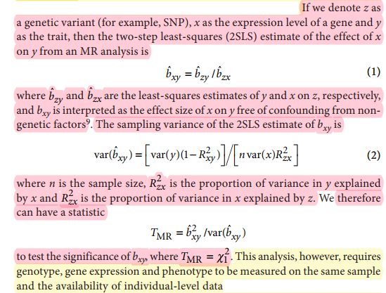

#  MRkit

    

##  Introduction

**MRkit** is used to perform Mendelian randomization (MR) analysis to reveal the relationship between gene expression levels and phenotype. Details about the calculation can be found [here](#Reference). In brief, it calculates a 2-step least squares (2SLS)  estimate of $x$ on $y$ ,  $\hat{b_{xy}}$ , which equals to $\hat{b_{zy}}/\hat{b_{zx}}$ , and its corresponding test statistic $\rm{T_{MR}}=\chi_{1}^{2}=\hat{b_{xy}}/\rm{var}(\hat{b_{xy}})$ , to test the significance of $b_{xy}$ in revealing the association between the expression level of a gene and the phenotype. Here, $x$ is the gene expression level, $y$ is the phenotype, $z$ is the SNP most significantly associated with the gene detected by eQTL analysis and as an instrumental variable in the MR analysis.  $\hat{b_{zy}}$ and $\hat{b_{zx}}$ are the least-squares estimates of $y$ and $x$ on $z$, respectively, and $b_{xy}$ is interpreted as effect size of $x$ on $y$ free of confounding from non-genetic factors.




##  Download

```
git clone https://github.com/bingochenbin/MRkit.git
```

##  Requirements

The **MRkit** only contains two command line tools, `VCFgt2num_converter.py` and `MR_analysis.R`, which have the following requirements:

python >= 3.8

R >= 4.1

In addition, the following R packages should be installed in your R environment:

data.table

foreach

iterators

doParallel

optparse

> **Note:** All the programs are designed for parallel computation. Typing name of any program followed by `-h` to show the help for the program.

##  Input

> **Caution:** The sample IDs in the input datasets must be identical and in the same order, and the missing values must be represented as "NA" values. In addition, all input data must be tab-delimited and have a header line.

###  1. The SNP genotyping data

> **Caution:** The SNP genotyping data should only contain biallelic SNPs.

To prepare the SNP genotyping data for input, you need to first extract the GT information (genotype, encoded as allele values separated by either / or |) from your VCF file:

```bash
# Extract the GT from your VCF file using bcftools software
bcftools query -H -f '%CHROM\t%POS\t%ID\t%REF\t%ALT[\t%TGT]\n' /path/to/your/vcf \
 | sed -r -e '1 s@:GT@@g;1 s@\[[0-9]+\]@@g;1 s@# @@' \
 | bgzip > SNPgeno.GT.vcf.gz
# Get the *.bim file corresponding to the VCF file using plink software
plink --vcf /path/to/your/vcf --make-bed -out SNPgeno --allow-extra-chr
```

Then, you need to convert the genotypes in the `SNPgeno.GT.vcf.gz` file to numeric codes using the `VCFgt2num_converter.py` script. Specifically, the fifth column of the *.bim file indicates the minor allele, which is coded as 1, while the sixth column indicates the major allele, which is coded as 0. The numeric code corresponding to a genotype is the sum of these values.

```bash
python3 /python/to/MRkit/scripts/VCFgt2num_converter.py\
 -o SNPgenp_MR.txt\
 -v SNPgeno.GT.vcf.gz\
 -b SNPgeno.bim
```

Finally, the above `SNPgenp_MR.txt`  contains the input SNP genotyping data for performing MR analysis, and it looks like the following:

```
CHROM	POS	ID	REF	ALT	WMG001A	WMG002A	WMG003A	WMG004A	WMG005A	WMG006A	WMG007A	WMG008A	WMG009A	WMG010A	WMG011A	WMG012A	WMG013A	WMG014A	WMG015A	WMG016A	WMG017A	WMG018A	WMG019A	WMG020A	WMG021A	WMG022A	WMG023A	WMG024A	WMG025A	WMG026A	WMG027A	WMG028A	WMG029A	WMG030A	WMG031A	WMG032A	WMG033A	WMG034A	WMG035A	WMG036A	WMG037A	WMG038A	WMG039A	WMG040A	WMG041A	WMG042A	WMG043A	WMG044A	WMG045A	WMG046A	WMG047A	WMG048A	WMG049A	WMG050A	WMG051A	WMG052A	WMG053A	WMG054A	WMG055A	WMG056A	WMG057A	WMG058A	WMG059A	WMG060A	WMG061A	WMG062A	WMG063A	WMG064A	WMG065A	WMG066A	WMG067A	WMG068A	WMG069A	WMG070A	WMG071A	WMG072A	WMG073A	WMG074A	WMG075A	WMG076A	WMG077A	WMG078A	WMG079A	WMG080A	WMG081A	WMG082A	WMG083A	WMG084A	WMG085A	WMG086A	WMG087A	WMG088A	WMG089A	WMG090A	WMG091A	WMG092A	WMG093A	WMG094A	WMG095A	WMG096A	WMG097A	WMG098A	WMG099A	WMG100A	WMG101A	WMG102A	WMG103A	WMG104A	WMG105A	WMG106A	WMG107A	WMG108A	WMG109A	WMG110A	WMG111A	WMG112A	WMG113A	WMG114A	WMG115A	WMG116A	WMG117A	WMG118A	WMG119A	WMG120A	WMG121A	WMG122A	WMG123A	WMG124A	WMG125A
chr1A	44293	chr1A_44293	G	C	0	0	0	0	0	1	0	0	NA	0	0	0	0	0	0	0	0	NA	0	NA	0	0	0	0	0	0	0	0	0	0	0	0	0	0	0	0	0	0	0	0	NA	0	0	0	0	0	0	1	0	0
chr1A	47377	chr1A_47377	C	T	2	0	0	0	0	0	0	0	NA	0	0	1	0	0	0	0	0	NA	0	0	2	0	0	2	0	0	0	0	0	0	0	0	0	0	0	NA	0	0	0	0	NA	0	0	0	0	2	0	0	0	0	0	0	0	NA	0	0	0	0	NA	0	0	0	0	0
chr1A	59771	chr1A_59771	G	A	0	1	0	0	1	0	0	0	0	0	0	0	0	0	0	0	0	NA	1	0	0	0	2	0	0	0	0	0	0	0	0	0	0	0	0	0	1	0	0	1	NA	1	0	1	0	0	NA	0	0	NA	NA	0	0	0	0	0	1	0	NA	0	0	0	0	NA	0	0	0	0	0	0	1	0	0	0	NA	0	0	0	0	0	0	0	0	0
chr1A	59775	chr1A_59775	C	T	0	1	0	0	1	0	0	0	NA	0	0	0	0	0	0	0	0	NA	1	0	0	0	2	0	0	0	0	0	0	0	0	0	0	0	0	0	1	0	0	1	NA	1	0	1	0	0	NA	0	0	NA	NA	0	0	0	0	0	1	0	NA	0	0	0	0	NA	0	0	0	0	0	0	1	0	0	0	NA	0	0	0	0	0	0	0	0	0
chr1A	91617	chr1A_91617	G	A	0	0	0	0	2	0	2	0	NA	0	2	0	0	2	2	0	0	NA	0	0	2	0	0	0	0	2	2	NA	0	0	0	0	0	0	0	0	2	0	0	0	NA	0	0	2	2	NA	2	0	0	2	0	0	2	0	0
chr1A	94403	chr1A_94403	C	T	0	0	0	0	0	0	0	0	NA	0	0	0	2	0	0	0	2	NA	0	0	0	0	0	0	0	0	0	NA	0	0	0	0	0	0	2	0	0	2	2	2	NA	2	0	0	0	2	2	0	0	0
chr1A	107209	chr1A_107209	C	T	0	0	0	0	0	0	0	0	0	0	0	0	2	0	0	0	2	NA	0	1	0	0	2	2	2	2	2	1	0	2	0	2	0	0	0	2	1	0	0	1	NA	0	2	2	0	0	0	0	0	0	0	2	2	2	0	1	0	0	0	0	2	2	0	NA	0	0	2	2	0	2	0	2	0	2	1	2	0	2	1	0	0	NA	0	0	0	0	0
chr1A	133475	chr1A_133475	C	T	0	0	0	0	0	0	0	0	NA	0	0	0	0	0	0	0	0	NA	0	0	0	0	0	0	0	0	0	0	0	0	0	0	0	0	0	0	0	0	0	0	NA	0	0	0	0	NA	0	0	0	0	0	0	0	0	0
chr1A	146430	chr1A_146430	C	A	0	0	0	0	2	0	2	0	NA	0	2	0	0	2	2	NA	0	NA	0	0	0	0	0	0	0	0	2	0	0	0	0	0	0	2	0	0	0	0	0	0	NA	0	0	2	2	NA	2	0	0	2	0	0	2	0	0

```

###  2. The eQTLs data

The eQTL data must contain four columns: column 1 should be the Gene ID, column 2 should be the associated eQTL with the Gene, column 3 should represent the SNP most significantly associated with the Gene in the eQTL, and column 4 should include the P-value corresponding to the SNP. Here is the example of the eQTLs data:

```
GeneID	eQTL	SNP	Pvalue
TraesCS1A02G000900	chr1A:1157892-1237436	chr1A_1176830	1.1521e-09
TraesCS1A02G000900	chr1A:1338726-1347248	chr1A_1346169	3.058955e-09
TraesCS1A02G000900	chr1A:2849218-2849335	chr1A_2849335	1.335856e-07
TraesCS1A02G000900	chr1A:3117209-3262121	chr1A_3262110	1.891741e-09
TraesCS1A02G000900	chr1A:3380025-3451632	chr1A_3388319	4.752083e-10
TraesCS1A02G000900	chr1A:3677521-3845279	chr1A_3761363	2.08425e-08
TraesCS1A02G002300	chr1A:505505-523633	chr1A_522091	6.325763e-18
TraesCS1A02G002300	chr1A:699531-800903	chr1A_799864	4.331337e-18
TraesCS1A02G002300	chr1A:1144542-1347913	chr1A_1170182	3.972977e-17
```

By considering the SNP with the strongest association signal within an interval as an eQTL, the eQTLs data can be similar to the following:

```
GeneID	eQTL	SNP	Pvalue
TraesCS1A02G000900	chr1A_1176830	chr1A_1176830	1.1521e-09
TraesCS1A02G000900	chr1A_1346169	chr1A_1346169	3.058955e-09
TraesCS1A02G000900	chr1A_2849335	chr1A_2849335	1.335856e-07
TraesCS1A02G000900	chr1A_3262110	chr1A_3262110	1.891741e-09
TraesCS1A02G000900	chr1A_3388319	chr1A_3388319	4.752083e-10
TraesCS1A02G000900	chr1A_3761363	chr1A_3761363	2.08425e-08
TraesCS1A02G002300	chr1A_522091	chr1A_522091	6.325763e-18
TraesCS1A02G002300	chr1A_799864	chr1A_799864	4.331337e-18
TraesCS1A02G002300	chr1A_1170182	chr1A_1170182	3.972977e-17
```

###  3. The gene expression levels data

The gene expression levels data consists of rows and columns representing samples and genes, respectively. Each row corresponds to a sample, and each column corresponds to a gene. The first column contains sample IDs, and the remaining columns contain expression levels for each gene. The values in each cell indicate the expression level of the corresponding gene for the respective sample. Here is an example of the gene expression levels data:

```
SampleID	TraesCS1A02G000900	TraesCS1A02G002300	TraesCS1A02G005500	TraesCS1A02G005600	TraesCS1A02G005700
WMG001A	-0.272017061710358	0.743909537792206	0.194734156131744	-0.107295274734497	0.372792392969131
WMG002A	2.04824256896973	0.620612382888794	0.757254421710968	0.0532063841819763	0.894102334976196
WMG003A	-1.4418785572052	0.157659411430359	0.516654014587402	0.460377097129822	0.940327048301697
WMG004A	-0.149225533008575	-0.128475815057755	0.132039785385132	-0.28729373216629	0.68341463804245
WMG005A	-1.23140954971313	0.283700793981552	-0.530603528022766	-0.0574047863483429	0.256372392177582
WMG006A	-1.18248176574707	1.38488328456879	-0.199847996234894	0.326062798500061	0.780471563339233
WMG007A	-0.330554485321045	0.0447497069835663	-0.0657132938504219	-0.539554834365845	0.150831282138824
WMG008A	-0.462489426136017	0.230420559644699	0.780251502990723	0.3719222843647	1.0348916053772
WMG009A	-1.07727098464966	-0.680115222930908	0.573799729347229	0.287048280239105	0.476123720407486
```

###  4. The phenotypic data

The phenotypic data contains two columns, in which each row represents a single sample, and the first column contains the sample ID, the second column contains the corresponding phenotypic value for that sample. Here is an example of the phenotypic data:

```
SampleID	Value
WMG001A	15.97
WMG002A	NA
WMG003A	NA
WMG004A	NA
WMG005A	15.63
WMG006A	6.67
WMG007A	28.89
WMG008A	34.44
WMG009A	6.67
```

##  Run the MR analysis

After you have already prepared the input datasets as requested, you can use the script `MR_analysis.R` to perform MR analysis. If this is your first time using the script, type its name followed by `-h` to display help information.

```
cmd> Rscript MR_analysis.R -h
Loading required package: parallel
Usage: MR_analysis.R [-h] -G FILENAME -E FILENAME -P FILENAME -Q FILENAME -d DIRECTORY -p outprefix [-n INT]

Perform the MR analysis to reveal the relationship between gene expression levels and the phenotype.
Note: Please see the https://github.com/bingochenbin/MRkit for details.


Options:
	-G FILENAME, --geno_input=FILENAME
		The SNP genotyping data file <required>

	-E FILENAME, --expr_input=FILENAME
		The gene expression levels data file <required>

	-P FILENAME, --pheno_input=FILENAME
		The phenotype data file <required>

	-Q FILENAME, --eqtl_input=FILENAME
		The eQTLs data file <required>

	-d DIRECTORY, --outdir=DIRECTORY
		Path to outdir <required>

	-p STR, --outprefix=STR
		Prefix to output filename <required>

	-n INT, --cpu=INT
		Number of cpu cores to use [default: 1]

	-h, --help
		Show this help message and exit
```

Then, you can use it to perform MR analysis similar to the following example:

```bash
Rscript /path/to/MRkit/scripts/MR_analysis.R -G SNPgeno_MR.txt -E MR_expr.txt -P MR_pheno.txt -Q MR_eQTLs.txt -d ./ -p MR_result_test
```

##  Output

After performing MR analysis, the main output file will be outprefix.MR.txt. This file contains seven columns: column 1 is the Gene ID, columns 2-4 are the SNP and its physical position on the genome, which is significantly associated with the Gene, column 5 is the estimated effect size of the gene expression level on the phenotype free of confounding from non-genetic factors, column 6 is the value of the test statistic $\rm T_{MR}$, and column 7 is the significance of  $b_{xy}$, which is used to evaluate the MR analysis result. Here is an example of the output that you can obtain by running the following example:

```
GeneID	TopSNP	CHROM	POS	Effect	TMR	Pvalue
TraesCS1A02G000900	chr1A_3388319	chr1A	3388319	4.13926110466306	0.931073513546659	0.334584128542825
TraesCS1A02G002300	chr1A_799864	chr1A	799864	-4.91637110673723	4.19837301887306	0.0404627826004724
TraesCS1A02G005500	chr1A_3116428	chr1A	3116428	-7.13784650537219	0.574713503382365	0.448391951424399
```

##  Example

Change the directory to the example and run the `run_MRanalysis.sh` to perform MR analysis using the example data.  This will enable you to verify that the scripts run correctly and also allow you to observe the input and output datasets.

```
cd example && nohup bash run_MRanalysis.sh > run_MRanalysis.out
```

##  Availability

MRkit is released under [Apache 2.0](https://directory.fsf.org/wiki/license:Apache2.0). The latest source code is [freely available at github](https://github.com/bingochenbin/MRkit). 

##  How to access help

Please don't hesitate to leave a message at github [`Issues`](https://github.com/bingochenbin/MRkit/issues) if you encounter any bugs or issues.  We will try our best to deal with all issues as soon as possible. In addition, if any suggestions are available, feel free to contact: **_Bin Chen_** [a1030539294@gmail.com](mailto:a1030539294@gmail.com).

##  Citation


##  Reference

1. Zhu, Zhihong, et al. "Integration of summary data from GWAS and eQTL studies predicts complex trait gene targets." *Nature genetics* 48.5 (2016): 481-487.

2. Liu, Shengxue, et al. "Mapping regulatory variants controlling gene expression in drought response and tolerance in maize." *Genome biology* 21.1 (2020): 1-22.

